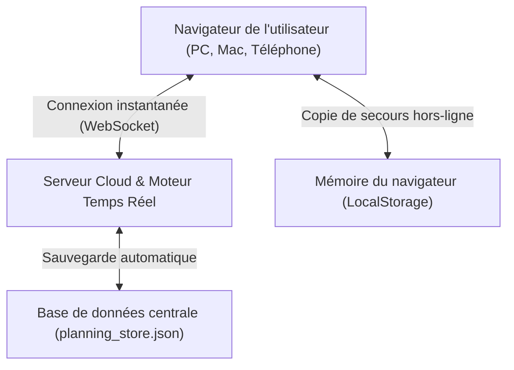

# 🏃‍♂️ Manuel Complet & Guide d'Utilisation — Plateforme Rétroplanning Run & Fun

> **Événement :** Course Solidaire Run & Fun — 10ème Édition  
> **Organisation :** Équipe étudiante IUT GEA, Équipe pédagogique & Bureau Des Étudiants (BDE)  
> **Lien du projet & Code source :** [https://github.com/Pirkah/retroplanning](https://github.com/Pirkah/retroplanning)  
> **Lien de l'application en ligne :** [https://retroplanning-collaboratif.onrender.com](https://retroplanning-collaboratif.onrender.com) *(ou via le raccourci local `start.command`)*

> [!NOTE]
> **Temps de chargement au premier clic (Hébergement Cloud Render) :**  
> Lorsque vous cliquez sur le lien après une période d'inactivité, il se peut qu'un écran de chargement Render apparaisse pendant environ **30 à 50 secondes**. C'est **tout à fait normal** : le serveur gratuit se met en veille pour économiser l'énergie quand personne ne l'utilise. **Il suffit de patienter quelques secondes sans fermer la page** : le serveur se réveille automatiquement et le rétroplanning s'affiche ! Toutes les consultations suivantes seront ensuite immédiates.

---

## 📑 Sommaire
1. [Pourquoi cette application a été créée (Le contexte)](#1-pourquoi-cette-application-a-été-créée)
2. [Comment elle a été conçue (Explication simple pour non-informaticiens)](#2-comment-elle-a-été-conçue)
3. [Les différents profils et droits d'accès](#3-les-différents-profils-et-droits-daccès)
4. [Guide complet d'utilisation pas à pas](#4-guide-complet-dutilisation-pas-à-pas)
   - [4.1 Connexion et gestion des mots de passe](#41-connexion-et-gestion-des-mots-de-passe)
   - [4.2 La Page d'Accueil (Hub d'équipe & Tâches personnelles)](#42-la-page-daccueil-hub-déquipe--tâches-personnelles)
   - [4.3 Le Diagramme de Gantt interactif (Planning par semaines)](#43-le-diagramme-de-gantt-interactif)
   - [4.4 Le Rétroplanning par Événements (Vue tableur)](#44-le-rétroplanning-par-événements)
   - [4.5 Les autres vues (Calendrier & Liste)](#45-les-autres-vues-calendrier--liste)
   - [4.6 La Boîte à Idées & Notes (Brainstorming)](#46-la-boîte-à-idées--notes)
   - [4.7 La Messagerie interne & Salons d'échanges](#47-la-messagerie-interne--salons-déchanges)
   - [4.8 Exports professionnels (Excel multi-onglets stylisé, PDF & Impression)](#48-exports-professionnels)
5. [Guide de dépannage rapide (FAQ)](#5-guide-de-dépannage-rapide)

---

## 1. Pourquoi cette application a été créée

L'organisation de la **10ème édition de la Course Run & Fun** est un projet d'envergure qui s'étale sur près d'une année scolaire. Elle mobilise de nombreux acteurs aux besoins différents :
- **L'équipe étudiante organisatrice (10ème promotion) :** doit répartir les charges de travail, suivre l'avancement au jour le jour, valider les étapes et échanger rapidement.
- **Les professeurs encadrants :** ont besoin d'une visibilité claire et synthétique sur l'avancement des étudiants, de contrôler le respect des échéances et de prodiguer leurs conseils.
- **Le BDE (Bureau Des Étudiants) :** doit pouvoir consulter les dates clés pour coordonner la vie associative de l'IUT sans risquer de modifier ou supprimer par inadvertance le travail des organisateurs.
- **Les visiteurs ou partenaires extérieurs :** doivent pouvoir consulter le calendrier prévisionnel en toute sécurité, sans voir les échanges privés internes.

### Les limites des outils traditionnels qui ont motivé ce développement :
1. **Les fichiers Excel envoyés par e-mail :** ils deviennent obsolètes dès le lendemain, créent des doublons (« planning_v2_final_FINAL.xlsx ») et empêchent le travail simultané.
2. **Le manque de clarté chronologique :** un tableau classique ne permet pas de visualiser d'un coup d'œil les périodes de surcharge ou les dépendances entre tâches.
3. **Le besoin de confidentialité ciblée :** les plannings doivent être publics pour l'école, mais les séances de remue-méninges (idées) et les discussions d'organisation interne doivent rester protégées.

> [!TIP]
> **La solution apportée :** Une plateforme web collaborative sur-mesure, accessible depuis n'importe quel appareil, synchronisée en temps réel et adaptée exactement aux rôles de chacun.

---

## 2. Comment elle a été conçue

*(Explication vulgarisée — aucun bagage technique requis)*

Pour que l'outil soit utilisable par tous sans friction, l'application a été développée comme un **site web moderne et autonome** :

### Les 3 principes clés de son fonctionnement :

1. **Aucun logiciel à installer :**  
   L'application s'ouvre directement dans n'importe quel navigateur web (Chrome, Safari, Firefox, Edge). Elle s'adapte aussi bien aux grands écrans d'ordinateur qu'aux téléphones portables.
   
2. **Synchronisation instantanée en direct (Temps réel) :**  
   Lorsque quelqu'un modifie une tâche, valide une étape ou poste un message, l'information est envoyée en quelques millisecondes au serveur, qui la transmet aussitôt aux autres personnes connectées. **Pas besoin d'actualiser la page F5**, les changements apparaissent en direct sous vos yeux.

3. **Protection contre la perte de données (Double sécurité) :**  
   - Une copie complète est stockée sur le serveur Cloud central.
   - Une copie de secours est automatiquement conservée dans la mémoire de votre navigateur. Même en cas de coupure de connexion internet ou de redémarrage de l'hébergeur, vos modifications et vos mots de passe personnels ne sont jamais perdus.

---

## 3. Les différents profils et droits d'accès

Pour concilier transparence et confidentialité, l'application propose **4 niveaux d'accès distincts** :

| Profil | Qui est concerné ? | Droits sur le Rétroplanning & Gantt | Accès Messagerie | Accès Boîte à Idées | Exports (Excel, PDF, Impr.) |
| :--- | :--- | :---: | :---: | :---: | :---: |
| **Mode Visiteur (Lecture)** | Toute personne arrivant sur le site sans mot de passe | Consultation seule (aucune modification) | ❌ Masqué & Verrouillé | ❌ Masqué & Verrouillé | ✅ Autorisé |
| **Membres Organisateurs** | Vianney, Julien, Théo, Mathias, Sina | Modification totale (ajout, statut, dates, assignation) | ✅ Tous les salons d'équipe | ✅ Propositions, votes, statuts | ✅ Autorisé |
| **Équipe Pédagogique** | Christelle Voisin, Marius Chevalier | Supervision, consultation et modifications | ✅ Salon d'échanges encadrement & général | ✅ Consultation et validation | ✅ Autorisé |
| **Compte BDE** | Bureau Des Étudiants (IUT GEA) | Consultation seule (sécurisé anti-effacement) | ✅ Salon dédié avec l'équipe et les profs | ❌ Masqué & Réservé à l'organisation | ✅ Autorisé |

> [!IMPORTANT]
> **Sécurité du mode lecture :** Un visiteur ne peut ni lire vos messages d'équipe, ni voir vos idées de projets non validées. Les boutons et menus correspondants disparaissent automatiquement de son écran.

---

## 4. Guide complet d'utilisation pas à pas

### 4.1 Connexion et gestion des mots de passe

1. Cliquez sur le bouton **Se connecter** (situé en haut à droite de l'écran ou au centre de la page d'accueil).
2. Choisissez votre profil dans la liste des membres affichés (ou cliquez sur le compte **BDE IUT GEA**).
3. Entrez votre mot de passe :
   - Mot de passe général par défaut pour l'équipe : `rnf2026`
   - Mot de passe par défaut pour le BDE : `bde2026`
   - *Ou le mot de passe personnel que vous avez personnalisé.*
4. Cliquez sur **Se connecter**.

#### Pour personnaliser votre mot de passe :
Une fois connecté, cliquez sur votre nom en haut à droite, puis sur **Modifier mon mot de passe**. Indiquez l'ancien mot de passe, tapez votre nouveau mot de passe secret (au moins 3 caractères) et validez. Votre profil utilisera désormais ce nouveau mot de passe.

---

### 4.2 La Page d'Accueil (Hub d'équipe & Tâches personnelles)

La page d'accueil est conçue comme un tableau de bord de pilotage quotidien :

- **Bandeau de synthèse (en haut) :**  
  Affiche le pourcentage d'avancement global de la course, le nombre de tâches terminées, le nombre de tâches en cours et le nom du prochain grand jalon à venir.
- **Section « Mes tâches personnelles à faire » :**  
  Dès que vous êtes connecté avec votre nom, cet encart filtre automatiquement les actions qui vous sont attribuées et les classe par ordre chronologique pour que vous sachiez immédiatement quoi faire cette semaine.
- **Accès rapide aux 4 modules :**  
  Des cartes visuelles permettent d'ouvrir directement le **Gantt**, le **Rétroplanning par événements**, la **Boîte à Idées** ou la **Messagerie**.
- **Actualités du projet :**  
  Affiche les derniers messages échangés et les idées les plus votées par l'équipe.

---

### 4.3 Le Diagramme de Gantt interactif

Accessible via le menu **Gantt** ou le module 2 :

- **Vue par semaines (S1 à S52) :**  
  Chaque tâche dispose de sa propre ligne individuelle en cascade. Les barres colorées indiquent précisément la date de début et la date de fin.
- **Jalons clés :**  
  Les étapes majeures (Passation, Réunion sponsors, Jour J...) sont signalées par une icône d'étoile ou un losange doré pour attirer le regard.
- **Filtres rapides :**  
  - Vous pouvez filtrer par **collaborateur** (ex: afficher uniquement ce que doit faire Julien).
  - Vous pouvez filtrer par **catégorie** (Communication, Sponsors, Logistique, etc.).
  - Une barre de recherche permet de trouver une tâche par son nom en direct.
- **Créer une tâche :**  
  Cliquez sur le bouton bleu **+ Nouvelle tâche** en haut à droite, ou double-cliquez directement sur une case du calendrier.
- **Modifier une tâche :**  
  Cliquez simplement sur la barre de la tâche dans le diagramme pour ouvrir sa fiche détaillée (titre, dates, statut, responsable, priorité, avancement en %).

---

### 4.4 Le Rétroplanning par Événements

Accessible via le bouton **Rétroplanning (Excel)** :

Ce mode présente les actions sous forme de tableur clair, segmenté par événement (ex: *Passation & Lancement*, *Course Solidaire 2027*, *Recherche de Partenaires*) :
- Chaque événement a son propre onglet.
- Toutes les actions sont automatiquement triées par **ordre chronologique** (semaine après semaine).
- Des pastilles de couleur indiquent le statut :  
  🟢 **Terminé** | 🔵 **En cours** | ⚪ **À faire** | 🟣 **Jalon / Événement clé**

---

### 4.5 Les autres vues (Calendrier & Liste)

- **Vue Calendrier :** Présente le planning sous forme d'un calendrier mensuel traditionnel, idéal pour imprimer le planning d'un mois précis et l'afficher au bureau.
- **Vue Liste :** Affiche un tableau détaillé avec toutes les métadonnées (dates, descriptions, responsables, catégories) pour ceux qui préfèrent une lecture linéaire.

---

### 4.6 La Boîte à Idées & Notes

*(Accessible uniquement aux membres de l'organisation connectés)*

Un espace dédié à la créativité et aux propositions :
1. Cliquez sur **+ Proposer une idée**.
2. Renseignez un titre, une catégorie (*Animations, Restauration, Sponsors, Goodies...*) et une description.
3. Chaque membre de l'équipe peut voter en cliquant sur le **cœur ❤️**.
4. L'équipe peut faire évoluer l'état de l'idée : *En réflexion*, *Validée*, ou *Rejetée*. Dès qu'une idée est validée, elle peut être transformée en tâche officielle dans le planning.

---

### 4.7 La Messagerie interne & Salons d'échanges

*(Accessible aux membres connectés et au BDE)*

Une messagerie instantanée organisée en canaux thématiques :
- **#général :** Annonces importantes et discussions globales.
- **#course :** Parcours, autorisations administratives, sécurité, dossards.
- **#sponsors :** Démarchage d'entreprises, devis, dons et partenariats.
- **#communication :** Réseaux sociaux, affiches, site web, relations presse.
- **#échanges-encadrement-bde :** Le canal partagé où les étudiants, les professeurs encadrants et les représentants du BDE peuvent échanger leurs remarques et questions sans mélanger cela aux échanges techniques quotidiens des étudiants.

---

### 4.8 Exports professionnels

Pour envoyer des rapports ou afficher le planning en réunion, plusieurs options d'export de haute qualité sont intégrées :

#### 1. Export Excel stylisé (.xlsx)
Cliquez sur le bouton **Excel (.xlsx)** dans la vue Rétroplanning :
- **Onglet 1 (Synthèse Générale) :** Contient un récapitulatif élégant avec les indicateurs clés (pourcentage d'avancement, total de tâches, nombre de terminées/en cours) et le tableau chronologique de toutes les actions.
- **Onglets suivants (Un par événement) :** Chaque événement dispose de son propre onglet dédié, mis en page proprement avec des en-têtes colorés, des délimitations nettes et un dimensionnement automatique des colonnes pour être prêt à être imprimé ou envoyé à la direction de l'IUT.

#### 2. Export PDF & Image HD
Cliquez sur **Exporter** (icône de téléchargement) depuis le diagramme de Gantt pour générer un document paysage haute définition prêt pour vos présentations PowerPoint ou vos comptes-rendus.

#### 3. Impression papier vectorielle
Cliquez sur l'icône **Imprimante** : la mise en page supprime automatiquement les menus inutiles et optimise les couleurs pour sortir une version papier propre sur l'imprimante de l'école.

---

## 5. Guide de dépannage rapide (FAQ)

### ❓ J'ai oublié mon mot de passe ou il est refusé, que faire ?
Le mot de passe maître de secours est **`rnf2026`** pour l'équipe et **`bde2026`** pour le compte BDE. Vous pouvez l'utiliser à tout moment pour vous reconnecter, puis redéfinir votre mot de passe personnalisé.

### ❓ Est-ce que mes modifications écrasent celles de mes camarades ?
Non. Le système est conçu pour synchroniser chaque tâche indépendamment. Si Julien modifie une tâche de communication pendant que Vianney valide un jalon logistique, les deux modifications sont fusionnées et enregistrées en direct.

### ❓ Est-ce que le BDE peut supprimer des tâches par erreur ?
Non. Le compte BDE est configuré avec un statut de consultation stricte. Même s'ils se connectent, les boutons de suppression ou de modification de planning leur sont masqués.

### ❓ Le site affiche un écran de chargement Render pendant 30 à 50 secondes, est-ce normal ?
**Oui, c'est tout à fait normal !** Comme l'application est hébergée sur l'offre gratuite de Render, le serveur s'endort automatiquement lorsqu'il n'y a pas eu d'activité pendant plus de 15 minutes (afin d'économiser l'énergie). Dès que quelqu'un clique sur le lien, Render réveille le serveur. Il suffit de **patienter environ 30 à 50 secondes** sans rafraîchir frénétiquement : dès que le serveur est réveillé, le rétroplanning s'affiche et restera ultra-rapide pour toutes vos actions suivantes.

### ❓ Comment accéder à l'application depuis un autre ordinateur ?
Il vous suffit d'ouvrir le lien web partagé dans votre navigateur :
👉 **Lien Cloud public :** [https://retroplanning-collaboratif.onrender.com](https://retroplanning-collaboratif.onrender.com)  
*(Ou si vous travaillez sur le même réseau WiFi en local, utilisez l'adresse IP affichée dans la console de démarrage).*

---

*Document rédigé pour l'équipe Run & Fun — 10ème Édition — IUT GEA.*
